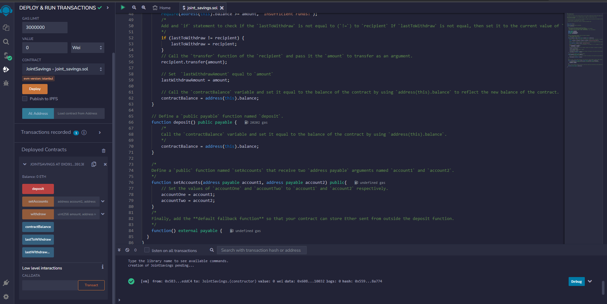
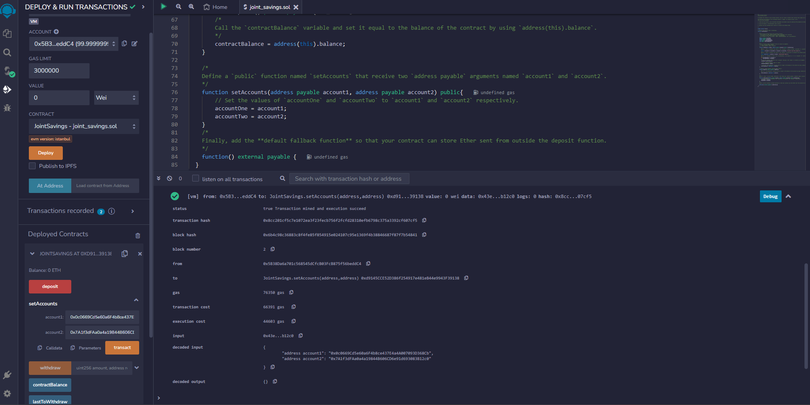
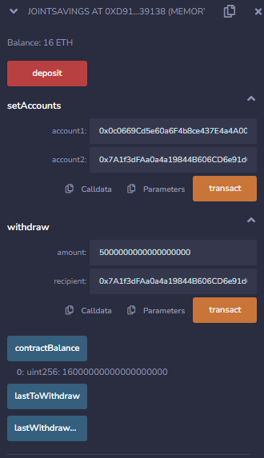
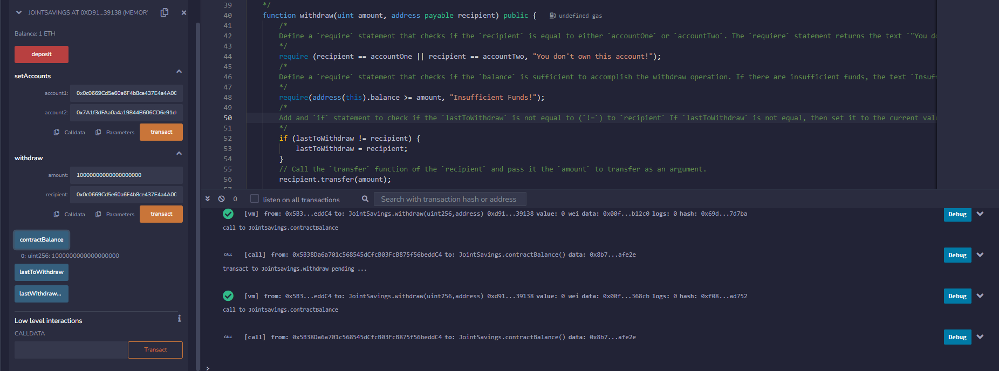
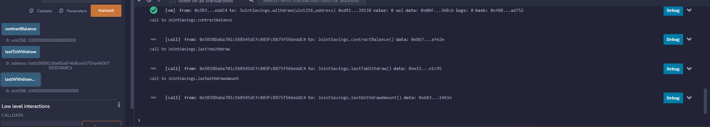

# Joint Savings

This project was to create a smart contract that can hold ether and only allow withdrawals from one of two accounts. 

* The joint_savings.sol holds the code for the smart contract. 

* The Execution_Results folder holds the screenshots of the contract deployment in the Remix VM. 

## Libraries

This application uses the following libraries and packages:

* Solidity
* Ganache
* Remix IDE
* Web3
* Ethereum Blockchain

## Deployment Results

* Contract was deployed successfully. 

* Dummy accounts were set. 

* Test Deposits of 10, 1, and 5 eth were made. Here is confirmation with contract balance at 16eth. 

* Test withdrawals from to the dummy accounts were successful. 

* Contract Balance, Last to Withdraw, and Last Withdraw Amount functions were also successful. 

